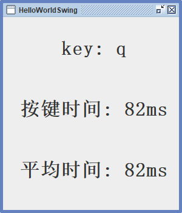

# HotKeyListener简介

[](https://github.com/IchiehPan/HotKeyListener/pulls)
[](https://github.com/IchiehPan/HotKeyListener/releases)


`HotKeyListener`是一个监听键盘按键时间的软件，基于Java环境运行。可以展示本次按键内容、时间及平均按键时间。

## 内容列表

- [背景](#背景)
- [使用说明](#使用说明)
- [运行截图](#运行截图)

## 背景

`HotKeyListener` 最开始因为某些篮球体育游戏需要控制按键时间，因此萌生了计算最佳按键时间的想法；
除此之外还需有统计平均按键事件的功能帮助排除误差值。

## 使用说明

如果已经配置了Java的环境变量，双击运行即可；

```sh
java -jar XXX.jar
```

## 运行截图
